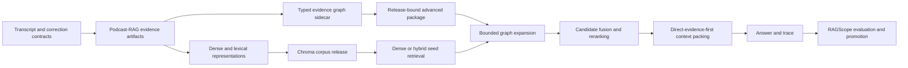

# Graph-Assisted RAG Design Augmentation

Status: proposed production augmentation built on the implemented M5 prototype  
Updated: 2026-08-12  
Primary owner: `Podcast-RAG-pipeline`  
Participating repositories: `Chroma DB Import`, `PodCast Chat`, and `RAGScope`

## 1. Decision Summary

The podcast ecosystem should evolve toward **graph-assisted hybrid RAG**, not a
graph-only replacement for the current dense, lexical, hierarchy, and reranking
pipeline.

The graph should act as a bounded evidence-expansion channel after conventional
retrieval finds high-confidence seeds. It is most applicable to cross-episode,
belief-evolution, contradiction, associative, and evidence-lineage questions.
Direct factual and single-episode questions should retain the existing retrieval
path unless evaluation demonstrates a benefit.

The initial production design continues to use portable, release-bound adjacency
artifacts. A dedicated graph database is out of scope until corpus scale or
measured operational requirements justify one.

## 2. Why This Fits the Existing Architecture

The ecosystem already contains most of the structural prerequisites:

- stable document and source-evidence identities;
- leaf chunks, cluster summaries, episode theses, and position cards;
- parent/child hierarchy and evidence-closure links;
- topic indexes and speaker/date metadata;
- evidence-bound temporal claims and adjacency;
- immutable corpus releases and processed deltas;
- judged retrieval metrics and RAGScope promotion authority.

An M5 prototype already implements:

- `evidence-graph-1.0` generation in Podcast-RAG;
- release-bound advanced sidecar packaging in Chroma DB Import;
- deterministic query classification and bounded graph expansion in PodCast
  Chat;
- graph paths, limits, fallbacks, and release lineage in advanced retrieval
  traces.

This augmentation therefore promotes and hardens an existing experimental path.
It does not introduce an unrelated retrieval architecture.

## 3. Goals

- Improve retrieval for relationships that are poorly represented by isolated
  vector similarity.
- Preserve direct transcript evidence as the authoritative grounding layer.
- Make every graph-derived result explainable through a typed path.
- Prevent graph expansion from weakening speaker, podcast, episode, or date
  constraints.
- Update graph artifacts incrementally from processed deltas and corrections.
- Measure graph value separately from dense, lexical, reranking, and answer-model
  behavior.
- Keep graph retrieval optional and fail safely to the promoted non-graph
  baseline.

## 4. Non-Goals

- Replacing Chroma with a graph database.
- Making graph traversal the default for every query.
- Treating topic co-occurrence or model-proposed relationships as facts.
- Allowing generated summaries to outrank direct transcript evidence by default.
- Open-ended agent traversal or unbounded multi-hop search.
- Automatically promoting candidate contradiction, identity, or semantic edges.
- Rebuilding all transcript or RAG processing solely to add graph support.

## 5. Target Architecture

The graph never creates evidence. It connects existing evidence and derived
artifacts so the retriever can discover relevant material that a query-to-chunk
similarity search missed.

## 6. Graph Contract

### 6.1 Node Types

Production graph nodes should use stable IDs and one of these bounded types:

| Node type | Purpose | Authority |
| --- | --- | --- |
| `document` | Leaf chunk, summary, thesis, or position-card reference | Existing processed artifact |
| `episode` | Episode grouping and date boundary | Episode contract |
| `speaker` | Stable speaker identity, not a diarization label | Approved speaker contract |
| `topic` | Curated topic identity and aliases | Topic index |
| `claim` | Evidence-bound canonical claim | Temporal research artifact |
| `source_span` | Optional direct transcript span reference | Transcript contract |

`SPEAKER_01`-style diarization labels must never become cross-episode identities.
Unresolved labels may remain episode-local metadata but cannot support recurring
speaker traversal.

### 6.2 Edge Types

Retain the prototype edges and introduce stronger evidence-specific edges
additively:

| Edge type | Meaning |
| --- | --- |
| `parent_child` | Structural hierarchy relationship |
| `claim_evidence` | Claim is grounded by a document or source span |
| `speaker_episode` | Approved speaker appears in an episode |
| `episode_document` | Document belongs to an episode |
| `topic_document` | Curated topic is evidenced by a document |
| `temporal_adjacency` | Claims or evidence are adjacent in the time series |
| `position_evidence` | Position card is supported by direct evidence |
| `speaker_position` | Approved speaker owns an attributable position |
| `claim_relation` | Candidate or approved reaffirmation, qualification, contradiction, or supersession |
| `correction_supersession` | New evidence supersedes a corrected prior artifact |

Generic `related_to` edges should not be admitted in the production contract.
They are difficult to interpret, encourage hub expansion, and obscure why a
result was retrieved.

### 6.3 Edge Evidence and State

Every edge must include:

- stable source and target IDs;
- edge type and direction;
- producer and contract version;
- parent corpus release ID;
- provenance identifying the source artifact;
- derivation method: `deterministic`, `human_approved`, or `model_candidate`;
- lifecycle state: `active`, `candidate`, `rejected`, or `superseded`;
- source-evidence IDs where the relationship makes a substantive claim;
- confidence or review state when applicable.

Only `active` edges participate in production traversal. Model-proposed
relationships remain `candidate` until accepted by an existing deterministic
rule or human review workflow.

## 7. Graph Quality and Validation

Graph production must emit a `graph-quality-report-1.0` beside the graph.
Validation should fail promotion for:

- dangling node or evidence references;
- duplicate node or edge identities;
- release, representation, or correction-lineage mismatches;
- active claim relationships without resolvable direct evidence;
- cross-episode speaker edges based only on diarization labels;
- invalid lifecycle states or unsupported edge types;
- cycles in relationships declared acyclic, such as correction supersession;
- active edges that point to superseded evidence without a valid replacement.

The quality report should also record non-fatal diagnostics:

- coverage by node and edge type;
- documents with and without graph links;
- topic and speaker degree distributions;
- high-degree hubs and their labels;
- orphan claims and positions;
- candidate versus active edge counts;
- direct-evidence path coverage;
- correction and delta effects;
- graph build time and artifact size.

High-degree topic hubs should be flagged using corpus-relative statistics rather
than one fixed degree threshold. A provisional warning threshold is the greater
of 50 linked documents or the 99th percentile of topic degree. RAGScope results
should determine the final policy.

## 8. Retrieval Design

### 8.1 Query Routing

Graph expansion is eligible for:

- `cross_episode`;
- `belief_evolution`;
- `contradiction`;
- `associative`;
- `evidence_lineage`.

It is disabled by default for direct factual, quote lookup, and tightly bounded
single-episode questions. The deterministic router remains the initial baseline.
A learned classifier may be evaluated later, but it must preserve the original
query and expose its classification evidence.

### 8.2 Retrieval Flow

1. Execute the original query through the promoted dense or hybrid retriever.
2. Preserve the original ranked candidates as immutable seeds.
3. Classify graph eligibility without relaxing hard filters.
4. Expand only approved edge types within fixed action, hop, fan-out, and total
   expansion budgets.
5. Reject graph candidates that violate podcast, speaker, episode, or date
   constraints.
6. Score or rerank the union of seed and graph candidates.
7. Prefer leaf/source-span evidence during context packing.
8. Include derived nodes only when their evidence closure is present.
9. Record paths, rejected paths, limits, latency, and fallback state in the trace.

### 8.3 Default Bounds

The prototype defaults remain the conservative production candidate:

- maximum graph actions: 1 unless late-interaction reranking is also enabled;
- maximum hops: 1;
- maximum fan-out per node: 4;
- maximum accepted graph expansions: 8;
- no hard-filter relaxation;
- no open-loop retries.

Two-hop traversal should be a separate evaluated profile. It must not be enabled
merely because the graph supports it.

### 8.4 Candidate Ordering

Graph candidates must not receive an arbitrary score comparable to vector
distance. Use one of two measured strategies:

1. append graph candidates as a separate retrieval channel and rerank the union;
2. use rank-based fusion with explicit channel weights.

The evaluation must compare both. Direct transcript evidence should win ties
over summaries, topics, and claims. Graph-only derived nodes with no packed
direct evidence must not be sent to answer generation.

## 9. Incremental Graph Maintenance

Graph rebuilding should consume `processed-delta-v1` and correction lineage.

For each changed episode:

1. identify added, changed, removed, and superseded document IDs;
2. remove or supersede incident edges for affected nodes;
3. rebuild deterministic hierarchy, episode, topic, and evidence edges locally;
4. refresh claim and temporal edges only for affected speakers/topics/time spans;
5. retain unaffected graph partitions byte-for-byte where practical;
6. validate full-graph referential integrity and evidence closure;
7. emit old-to-new node and edge mappings;
8. produce a new immutable graph ID bound to the target corpus release.

The graph delta should report:

- added, changed, removed, and superseded node IDs;
- added, changed, removed, and superseded edge IDs;
- affected episodes, speakers, topics, and claims;
- stale graph-derived judgments for RAGScope;
- whether a full rebuild was required and why.

A correction must never silently leave an active graph edge pointing at stale
text or a superseded source span.

## 10. Repository Responsibilities

| Repository | Responsibility |
| --- | --- |
| Podcast-RAG | Build and validate graph nodes, edges, quality reports, and graph deltas from authoritative evidence artifacts |
| Chroma DB Import | Package graph sidecars with the exact corpus release, validate compatibility, stage atomically, and preserve rollback |
| PodCast Chat | Route eligible queries, retrieve seeds, perform bounded expansion, preserve hard filters, rerank, pack evidence, and emit traces |
| RAGScope | Hold judged query slices, compare profiles, inspect graph paths, identify stale judgments, and approve or reject promotion |

No consumer may repair malformed producer graph evidence implicitly. Contract
violations must fail closed or fall back to the promoted non-graph baseline.

## 11. Evaluation Program

### 11.1 Compared Profiles

Run identical judged queries and corpus releases through:

1. dense baseline;
2. dense plus lightweight reranking;
3. dense and lexical hybrid;
4. hybrid plus reranking;
5. dense plus bounded graph expansion;
6. hybrid plus bounded graph expansion;
7. hybrid plus graph expansion and reranking.

Late interaction should be measured separately so its gain is not attributed to
the graph.

### 11.2 Query Slices

Report metrics overall and separately for:

- direct factual and quote lookup;
- cross-episode association;
- belief evolution and timeline;
- contradiction or revision;
- speaker comparison;
- evidence lineage;
- unanswerable or insufficient-evidence controls.

The private evaluation pack should include reviewed graph-positive examples
where relevant evidence is not already present in the dense baseline's top ten.
Otherwise graph expansion cannot demonstrate unique value.

### 11.3 Metrics

- Recall@5/10/20, MRR@10, and nDCG@10;
- direct-evidence coverage@10;
- graph-only relevant evidence discovered;
- graph expansion precision;
- duplicate and noisy-hub rate;
- unsupported-answer and correct-abstention rate;
- hard-filter preservation;
- p50 and p95 retrieval latency;
- context tokens and graph artifact storage;
- fallback and graph-package mismatch rate.

Generation quality must be evaluated separately from retrieval quality.

### 11.4 Provisional Promotion Gate

Graph-assisted retrieval may be promoted for a query class only when the private
campaign demonstrates all of the following:

- at least a 5 percentage-point improvement in Recall@10 or nDCG@10 on the
  targeted graph-positive slice;
- at least 95% preservation of the candidate's measured gain under bootstrap
  resampling or a similarly documented robustness check;
- no more than a 1 percentage-point regression on direct factual retrieval;
- no reduction in direct-evidence coverage;
- no increase in unsupported-answer rate;
- 100% hard-filter preservation in contract tests and reviewed traces;
- p95 retrieval latency increase no greater than 20% or 300 ms, whichever is
  larger, unless the operator explicitly accepts a slower research profile;
- every accepted graph result has a valid path to direct evidence.

These thresholds are initial governance defaults. RAGScope may revise them only
through a versioned promotion policy, not ad hoc interpretation of one run.

## 12. Observability

Extend advanced retrieval traces with:

- graph and graph-quality-report IDs;
- corpus release and representation IDs;
- router version and query class;
- original seed IDs and ranks;
- traversed and rejected paths;
- edge types and directions used;
- per-edge provenance and lifecycle state;
- expansion stop reason and all configured bounds;
- graph-only candidate IDs;
- post-fusion/rerank positions;
- packed direct-evidence IDs;
- graph, rerank, and total latency;
- fallback reason and baseline result preservation.

RAGScope should make false-positive paths inspectable. A useful graph evaluation
must show not only that a result was wrong, but which edge introduced it.

## 13. Delivery Phases

### G0. Establish the entry gate

- Bind a reviewed private query slice and accepted dense/hybrid baseline.
- Identify concrete graph-positive failures.
- Record simpler methods already attempted and the expected graph gain.
- Keep the existing `advanced-retrieval-entry-gate-1.0` mandatory.

Exit: the experiment has real failing queries, budgets, and stop conditions.

### G1. Harden the producer graph

- Extend the graph contract and lifecycle states.
- Add graph quality validation and report generation.
- Require stable speaker identity for cross-episode edges.
- Add direct position-evidence and correction-supersession edges.

Exit: synthetic and private fixtures produce valid, explainable graphs with no
dangling or stale evidence.

### G2. Implement graph deltas

- Consume processed deltas and correction lineage.
- Rebuild affected partitions and preserve unaffected graph content.
- Emit graph delta and stale-judgment effects.

Exit: a one-episode correction does not require a full graph rebuild and leaves
no active stale edges.

### G3. Bind graph packages to corpus releases

- Include graph quality and delta identities in the advanced package.
- Stage and validate packages alongside the exact Chroma release.
- Make promotion and rollback atomic from the consumer's perspective.

Exit: Chat cannot load a graph package from a different corpus release, and a
failed graph package does not block baseline retrieval.

### G4. Mature bounded retrieval

- Add evidence-lineage routing and typed edge allowlists by query class.
- Evaluate fusion, reranking, one-hop bounds, and hub suppression.
- Preserve existing fallback and trace behavior.

Exit: all query classes have deterministic routing, bounded work, and complete
trace evidence.

### G5. Evaluate and promote selectively

- Run all compared profiles in RAGScope.
- Review graph-only gains and false-positive paths.
- Promote graph expansion independently by query class.
- Keep failing or neutral classes on the non-graph baseline.

Exit: a signed promotion record identifies enabled classes, graph/package IDs,
limits, metrics, and rollback target.

### G6. Reassess storage technology

- Measure graph artifact size, load time, traversal latency, and update cost.
- Consider a graph database only if the portable sidecar breaches documented
  operational budgets.

Exit: retain portable adjacency or approve a separately designed storage
migration with equivalent contracts and rollback.

## 14. Test Strategy

### Unit tests

- stable node and edge identity;
- edge lifecycle and provenance validation;
- query classification and edge allowlists;
- cycle, hop, fan-out, and expansion bounds;
- hard-filter preservation;
- hub suppression and candidate ordering;
- graph delta partitioning and supersession.

### Contract tests

- Podcast-RAG graph to Chroma sidecar package;
- sidecar package to Chat loader;
- Chat trace to RAGScope ingestion;
- corpus-release mismatch refusal;
- older `evidence-graph-1.x` additive compatibility;
- graph unavailable or corrupt baseline fallback.

### Integration tests

- vector seeds expand to related direct transcript evidence;
- factual queries remain seed-only;
- corrections remove stale paths;
- speaker/date filters survive bidirectional traversal;
- rollback restores a consumer-readable graph/package pair;
- graph and non-graph result sets are captured for paired evaluation.

## 15. Risks and Controls

| Risk | Control |
| --- | --- |
| Noisy topic hubs overwhelm results | Curated topics, degree diagnostics, edge allowlists, fan-out caps, and evaluated hub suppression |
| Incorrect speaker identity creates false connections | Approved stable speaker IDs only; episode-local labels cannot cross episodes |
| LLM-proposed contradictions become treated as facts | Candidate lifecycle state, direct evidence, human review, and production traversal of active edges only |
| Graph expansion hurts simple queries | Query-class gating and immutable seed-only fallback |
| Traversal becomes slow or unpredictable | Fixed hops, fan-out, action, expansion, timeout, and context budgets |
| Corrections leave stale graph evidence | Delta-bound rebuilds, supersession edges, integrity checks, and stale-judgment emission |
| Graph and Chroma releases diverge | Exact corpus-release binding and fail-closed package validation |
| Aggregate metrics conceal regressions | Per-query-class metrics and independent promotion by class |

## 16. Recommended Next Action

Do not add more graph infrastructure first. Complete G0 using the private
evaluation pack and current prototype:

1. select reviewed cross-episode, evolution, contradiction, and lineage queries;
2. capture the promoted dense/hybrid baseline;
3. run the existing one-hop graph profile on the same release;
4. inspect graph-only relevant discoveries and false-positive paths;
5. use those results to prioritize G1 edge and validation improvements.

This sequence gives the graph a fair chance to prove value while preventing a
large architecture investment based only on plausibility.
